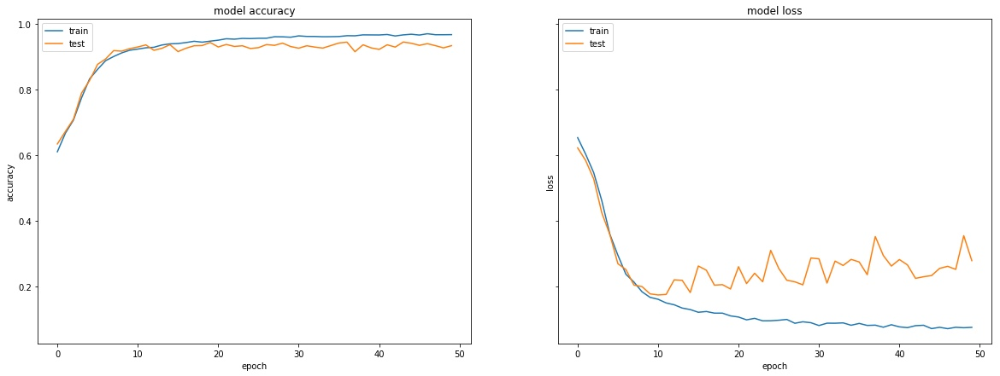
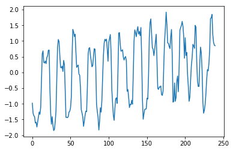
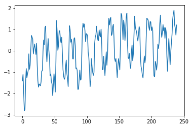
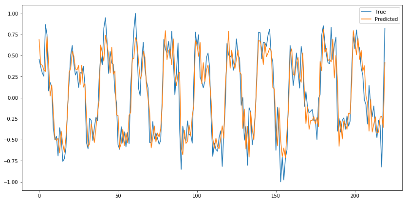

# Brain-activity-classification-and-regression

I was always fascinated with medicine and biology. Particularly, I'm interested in the prevention of the diseases as opposed to their treatment. One of my friends, a scientist, captivated my attention with a really cool biofeedback study, where a person lies inside the magnetic resonance imaging (MRI) scanner, sees his indicators and changes them with an effort of will. Alternatively, a person wears a heart rate monitor and by augmenting the will he or she changes the pulse. As another option, he or she sees signals from an electroencephalograph and also changes those.
I am particularly impressed that my friend's study is focused on people suffering from depressive disorders. I believe that such a treatment is the future. The body ceases to be a black box, at the entrance of which it is served with medications, while at the exit it gets relief from pain or depression. On the other hand, within the approach of my friend, a person sees what is actually happening in his head, and receives not only understanding, but also control over these processes. This idea captured me completely. Being a data scientist, I decided to join this process.

This capston project consists of two parts: classification of brain activity images from EEG and prediction of time-series from MRI. 

## Classification of brain activity from electroencephalograph (EEG)

### Problem

Electroencephalography is an electrophysiological monitoring method to record electrical activity of the brain. It is typically noninvasive, with the electrodes placed along the scalp. EEG has several tens of electrods (or sensors).

Raw EEG is N time series, where N is a number of electrods.

EEG recording is a mixture of both target signals and multiple third-party signals, noise artifacts. The noise complicate not only the visual presentation of signal, but also algorithmic post-processing. Clearing data from noise artifacts is a very important and time-consuming task requiring expert level of knowledge and experience of the experimenter. It leads to bad reproducibility of results not only between different teams, but even inside one team and inside one experiment, since the work of an expert is subject to many human factors (fatigue, time limit, errors). Also, if during processing the experimenter decides to change the design processing, then, as a rule, this leads to the need to perform cleaning again.

Many other physiological components can also be removed if their characteristic signal is not in the area of interest of the experimenter. For the classification of components by the experimenter, there are several methods of graphical representation, among which the most popular are spectral power, the intensity of the component on the electrodes, and the intensity in time.

If we split every time series into blocks of several seconds and then depict all this signals on a map of the head we can see such pictures (left - noise, right - target signal):

My task is to create a convolutional neural network (CNN) for classifying this components into noise and signals.

### Gathering the data and preprocessing

At the enter of the project I had 7,241 images, 1,700 of them are noise. It's a large enough dataset but it can be better. Firsf of all I flipped every image horizontally and added these new images to my original dataset so I've got 14,482 images. Then I balanced classes - I bootstrapped set of 11,082 images from 3,400 noise images. Now I had 22,164 images, e.g. three times more than I had at the start. 

### Modelling

For classification I have chosen a convolitional neural network (CNN). It has 4 convolutional layers, 4 max-pooling layers, 2 flatten layers and 2 full layers. As a result I have got a model that classify images with 94.5% accuracy.

## Magnetic resonance imaging (MRI) time series regression

### Problem

The second part of the work is devoted to neurofeedback (NFB). NFB is used to treat various diseases. Recently, more and more NFB protocols are using tomographic data as a basis for highlighting the area of interest used as a NFB target. The disadvantage of the MRI technique is that one volume is removed within a few seconds, in our case 2.5. During this time, only one point changes to display the NFB. Since the response function is time-wise with an average constant of 5 seconds, the use of machine learning methods for predicting the NFB dynamics will substantially reduce the moral discomfort of waiting for the test person.

### Gathering the data and preprocessing

As a learning corps were taken five records of the NFB sensory-motor cortex activation dynamics in healthy subjects which carried out both activation and deactivation of the cortex at the operator's command. All the time-series are of the same length and the same nature, so I can create one model based on all the rows. To increase the amount of data I connected the ends of the rows and cut them in other places. Thus I created twenty more time series and I got twenty five.

### Modelling

As a model I choose Long short-term memory (LSTM) neural network. It has only one LSTM layer and an output layer with one node (because we solve regression problem). It is practically proven that one LSTM layer is enough for this task.

