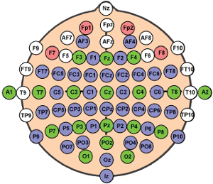
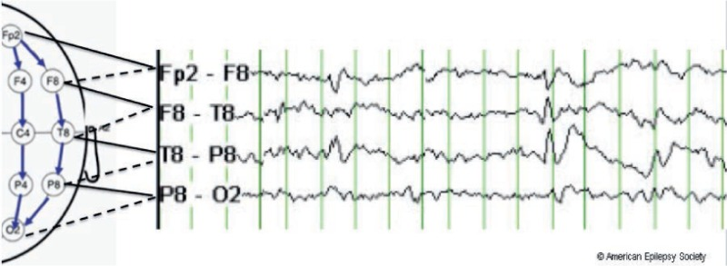
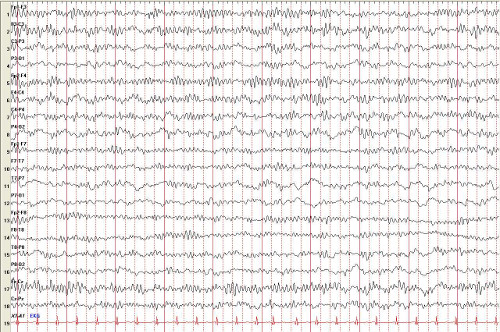
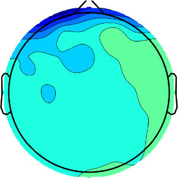
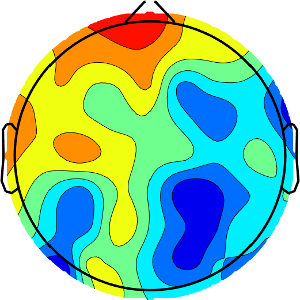

# Brain-activity-classification-and-regression
This capston project consists of two parts: classification of brain activity images from EEG and prediction of time-series from MRI.

## Classification of brain activity from electroencephalograph (EEG)
Electroencephalography is an electrophysiological monitoring method to record electrical activity of the brain. It is typically noninvasive, with the electrodes placed along the scalp. EEG has several tens of electrods (or sensors).

Raw EEG is N time series, where N is a number of electrods.

If we split every time series into blocks of several seconds and then depict all this signals on a map of the head we can see such pictures:

